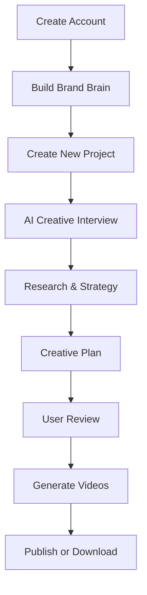

# Product Requirements Document (PRD)

**Project Name:** (Working Title) AI Creative Studio
**Version:** 1.0
**Status:** Draft
**Document Owner:** Founding Team
**Last Updated:** August 2026

---

# 1. Executive Summary

## Vision

Build the simplest AI-native platform that enables emerging brands to generate high-quality UGC-style marketing videos without requiring expertise in prompting, creative strategy, or content production.

Unlike existing AI video generators that expect users to know what to create, our platform first understands the business objective, researches the creative landscape, plans the content, and then generates production-ready videos.

The platform is not positioned as another AI video generator.

It is positioned as an AI Creative Studio.

---

## Mission

Transform business ideas into production-ready UGC videos through AI-guided creative thinking.

---

## Product Promise

> Stop prompting AI. Start creating marketing videos.

---

# 2. Problem Statement

Today's AI video generation platforms assume users already know:

- what kind of video to create
- how to write prompts
- what marketing angle to use
- what hooks convert
- what style performs
- what audiences resonate with

This creates friction for the very audience AI should empower.

Emerging brands often have:

- products
- marketing budget
- willingness to advertise

but lack:

- creative strategy
- marketing experience
- prompt engineering knowledge
- agency resources

Existing solutions solve video generation.

They do not solve creative decision making.

---

# 3. Opportunity

The rise of generative AI has drastically reduced the cost of producing creative assets.

However, the strategic thinking that happens before generation remains largely manual.

Businesses are forced to move between multiple tools:

- ChatGPT
- Midjourney
- Veo
- Runway
- HeyGen
- Canva
- Notion
- Google Docs

Our platform consolidates this process into one guided experience.

---

# 4. Product Vision

Our long-term vision is to become the creative operating system for modern brands.

However, the MVP focuses on one problem exceptionally well:

> Helping businesses generate better UGC videos through guided AI strategy.

Campaign management, analytics, optimization and autonomous marketing are intentionally excluded from the MVP.

---

# 5. Goals

## Primary Goals

- Eliminate prompt engineering
- Simplify creative planning
- Produce production-ready UGC videos
- Reduce time from idea to video
- Make AI accessible to non-technical marketers

---

## Success Criteria

Users should be able to:

- onboard their brand once
- describe a marketing need
- receive AI-guided creative planning
- generate multiple UGC video variations
- publish or download videos

within minutes.

---

# 6. Non Goals

The MVP will NOT include:

- Campaign management
- Performance analytics
- Budget management
- CRM
- Email marketing
- Team collaboration
- Agency workspaces
- Marketing automation
- AI optimization loops
- A/B testing dashboards

These are future roadmap items.

---

# 7. Target Audience

## Primary Audience

Emerging D2C brands.

Examples include:

- Supplements
- Fashion
- Beauty
- Skincare
- Wellness
- Lifestyle products

Characteristics:

- Small teams
- Marketing budget available
- Need constant creative production
- Limited marketing expertise
- No in-house creative department

---

## User Persona

### Founder

"I know I need marketing.

I don't know what creative to make."

---

### Marketing Manager

"I need more content faster without relying on agencies."

---

### Solo Creator

"I know my product.

I don't know how to convert that into ads."

---

# 8. Product Principles

Every product decision should follow these principles.

---

## Think Before Generating

Strategy precedes generation.

---

## AI Should Guide

Users should never feel like prompt engineers.

---

## Minimize Cognitive Load

Reduce decisions wherever possible.

---

## Human Approval Matters

The AI recommends.

The human approves.

---

## Context Beats Prompting

The platform should rely on accumulated business context instead of isolated prompts.

---

# 9. Core User Journey



---

# 10. Product Architecture

The platform revolves around six core modules.

---

## Module 1 — Brand Brain

The Brand Brain acts as persistent memory.

It stores:

- Brand identity
- Logo
- Colors
- Products
- Website
- Target audience
- Competitors
- Brand voice
- Existing assets
- Previous creative history

This information continuously improves future generations.

---

## Module 2 — Projects

Projects are the primary workspace.

Each project represents one creative objective.

Examples:

- Launch Product
- Summer Sale
- Founder Story
- Product Demo
- Customer Testimonial

Each project contains:

- Creative interview
- Research
- Creative plan
- Generated videos
- Publishing history

---

## Module 3 — AI Creative Interview

Instead of prompting,

users answer guided business questions.

The AI dynamically adjusts its questions based on previous answers.

The goal is to understand:

- objective
- audience
- offer
- messaging
- product
- desired outcome

Output:

Structured creative brief.

---

## Module 4 — Inspiration Import

Users can:

- share directly from social apps
- paste links
- upload videos

The AI analyzes:

- hook
- pacing
- storytelling
- editing
- emotion
- visual style
- CTA
- structure

It extracts concepts rather than copying creative work.

Outputs are stored inside the Creative Vault.

---

## Module 5 — Creative Vault

Persistent library containing:

- inspirations
- hooks
- concepts
- references
- previous generations
- favorite ideas

Searchable through AI.

---

## Module 6 — Video Generation

Using the Brand Brain,

Creative Brief,

Research,

and Creative Plan,

the AI generates multiple production-ready UGC videos.

Users can generate:

- single video
- multiple variations
- batch generations

---

# 11. User Flows

## Flow A

Dashboard Driven


---

## Flow B

Inspiration Driven


---

# 12. Functional Requirements

## Authentication

- User registration
- Login
- Billing
- Workspace settings

---

## Brand Brain

- Create
- Edit
- Update
- Store assets

---

## Project Management

- Create
- Archive
- Duplicate
- Delete

---

## AI Creative Interview

- Dynamic questioning
- Context awareness
- Structured output

---

## AI Research

Automatic research on:

- competitors
- audience
- trends
- UGC styles

---

## Creative Planning

Present:

- Goal
- Hook
- Style
- Story
- Scene breakdown
- References
- Confidence score

---

## Video Generation

Generate:

- multiple variations
- different hooks
- different openings
- multiple aspect ratios

---

## Publishing

Support:

- Direct publishing to connected social accounts
- Optional download/export for manual posting

Publishing is user-controlled and never automatic by default.

---

# 13. Navigation

```
Home

Projects

Creative Vault

Brand Brain

Settings
```

---

# 14. Future Roadmap

The following capabilities are intentionally excluded from the MVP but align with the long-term vision:

- Campaign management
- Content calendars
- Multi-platform scheduling
- Performance analytics
- AI optimization loops
- Trend monitoring
- Competitor monitoring
- Team collaboration
- Agency workspaces
- Creative performance prediction
- Autonomous marketing workflows

---

# 15. Business Model

Subscription SaaS.

Suggested pricing:

Starter

Growth

Business

Enterprise

Video generation usage may be governed through monthly credits and usage-based overages.

---

# 16. Competitive Positioning

The platform does not compete on video generation alone.

It competes on creative thinking.

Instead of asking users to engineer prompts,

the platform guides them through business context and marketing intent before generating assets.

The primary differentiation lies in:

- AI-guided creative interviews
- Persistent Brand Brain
- Inspiration-driven workflows
- Research-assisted planning
- Context-aware generation
- Reduced cognitive load

---

# 17. Success Metrics

Primary metrics:

- Brand Brain completion rate
- Time from project creation to generated videos
- Number of projects created per user
- Number of generated videos per project
- Inspiration imports per active user
- Direct publishing adoption
- Subscription conversion
- User retention

---

# 18. Risks

## Product Risks

- Low-quality generated videos
- High inference costs
- Overly complex onboarding
- User distrust in AI recommendations

---

## Business Risks

- Rapid competition
- Model commoditization
- Platform API changes
- Copyright concerns around inspiration analysis

---

## Mitigation

- Focus on product experience instead of model quality alone
- Keep humans in approval loop
- Build persistent Brand Brain
- Invest in AI-guided workflows rather than prompt engineering

---

# 19. Long-Term Vision

The MVP establishes the foundation for a broader AI Creative Studio.

As the product matures, it can evolve into a full creative operating system with campaign management, optimization, analytics, and autonomous marketing capabilities.

The guiding philosophy remains constant:

> AI should think before it creates.

By grounding every generation in business context, structured reasoning, and user intent, the platform aims to become the preferred creative partner for the next generation of digital-first brands.

---

# Appendix A — Guiding Philosophy

The platform should always prioritize:

- Simplicity over configuration
- Guidance over prompting
- Context over isolated requests
- Quality over quantity
- Human approval over blind automation
- Business outcomes over feature count

Every new feature should reinforce these principles.
