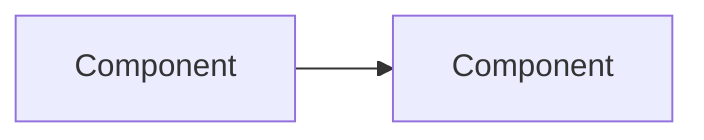
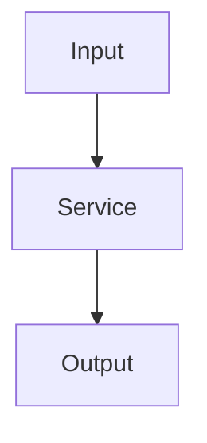

# Architecture — <task-id>

Architecture diagrams for this task, as Mermaid diagrams.
Update when the task's structure or data flow changes.

## System Context
_Who/what interacts with what, at a glance._

## Data Flow
_How data moves through this task's scope._

