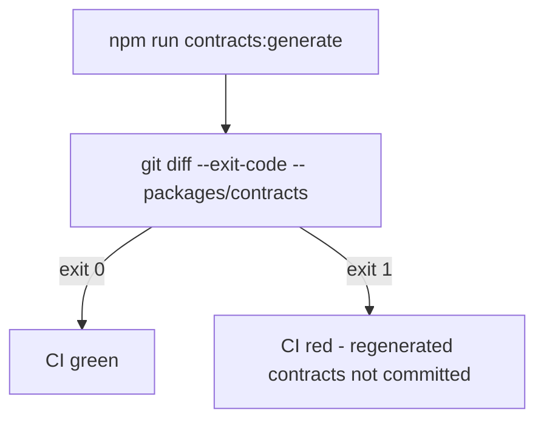

# Architecture — e1-contracts

## Contract Generation Pipeline

```mermaid
flowchart LR
    F[FastAPI app - Pydantic models] -->|app.openapi| EXP[scripts/export_openapi.py]
    EXP --> RAW[packages/contracts/openapi.json]
    RAW --> OT[openapi-typescript]
    OT --> DTS[packages/contracts/src/openapi.d.ts]
    DTS --> IDX[packages/contracts/src/index.ts - re-exports]
    IDX --> AC[packages/api-client - typed request helpers]
    AC --> W[apps/web]
```

## Drift Gate

```mermaid
flowchart TD
    GEN[npm run contracts:generate] --> DIFF[git diff --exit-code -- packages/contracts]
    DIFF -->|exit 0| PASS[CI green]
    DIFF -->|exit 1| FAIL[CI red - regenerated contracts not committed]
```
