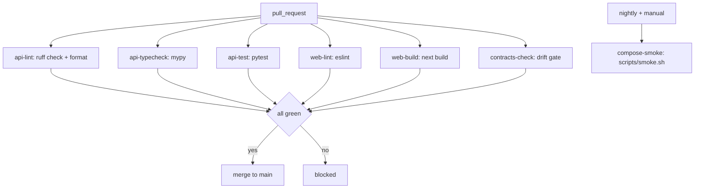
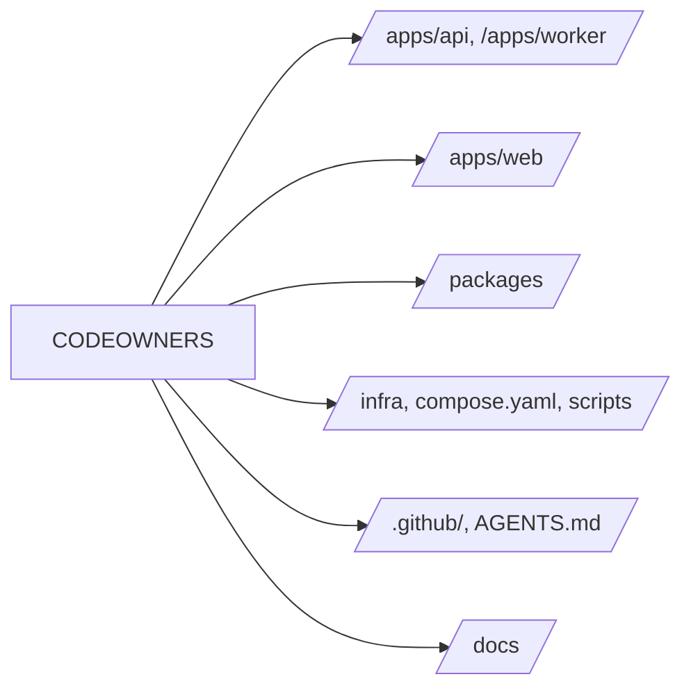

# Architecture — e1-governance

## CI Pipeline

```mermaid
flowchart TD
    PR[pull_request] --> AL[api-lint: ruff check + format]
    PR --> AT[api-typecheck: mypy]
    PR --> AP[api-test: pytest]
    PR --> WL[web-lint: eslint]
    PR --> WB[web-build: next build]
    PR --> CC[contracts-check: drift gate]
    SCHED[nightly + manual] --> CS[compose-smoke: scripts/smoke.sh]
    AL --> G{all green}
    AT --> G
    AP --> G
    WL --> G
    WB --> G
    CC --> G
    G -->|yes| MERGE[merge to main]
    G -->|no| BLOCK[blocked]
```

## Ownership Map

```mermaid
flowchart LR
    ROOT[CODEOWNERS]
    ROOT --> B[/apps/api, /apps/worker/]
    ROOT --> F[/apps/web/]
    ROOT --> P[/packages/]
    ROOT --> I[/infra, compose.yaml, scripts/]
    ROOT --> C[/.github/, AGENTS.md/]
    ROOT --> D[/docs/]
```
