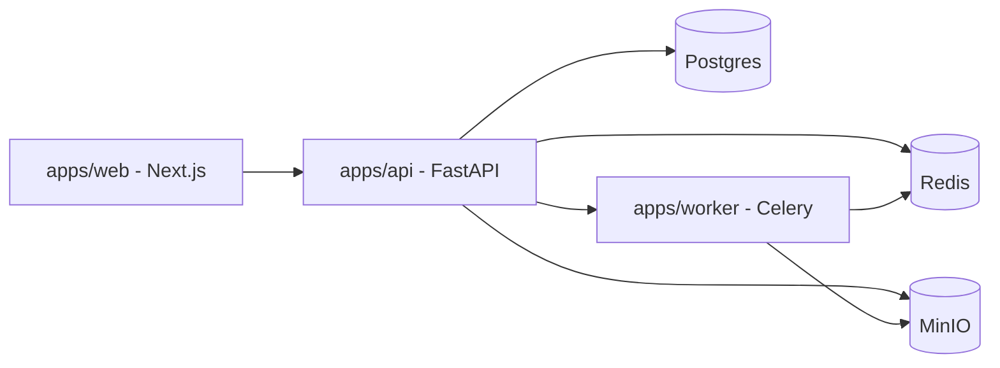
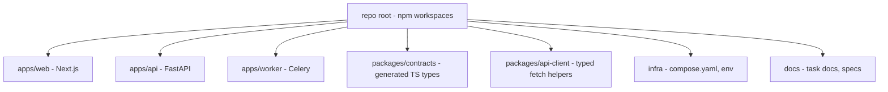
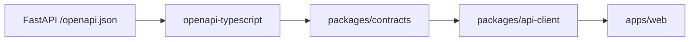

# Architecture — e1-initial-scaffold

## System Context

```mermaid
graph LR
    W[apps/web - Next.js] --> A[apps/api - FastAPI]
    A --> DB[(Postgres)]
    A --> R[(Redis)]
    A --> M[(MinIO)]
    WK[apps/worker - Celery] --> R
    WK --> M
    A --> WK
```

## Monorepo Layout

```mermaid
flowchart TD
    ROOT[repo root - npm workspaces]
    ROOT --> WEB[apps/web - Next.js]
    ROOT --> API[apps/api - FastAPI]
    ROOT --> WK[apps/worker - Celery]
    ROOT --> PC[packages/contracts - generated TS types]
    ROOT --> PAC[packages/api-client - typed fetch helpers]
    ROOT --> INFRA[infra - compose.yaml, env]
    ROOT --> DOCS[docs - task docs, specs]
```

## Contract Flow

```mermaid
flowchart LR
    F[FastAPI /openapi.json] --> GT[openapi-typescript]
    GT --> PC[packages/contracts]
    PC --> PAC[packages/api-client]
    PAC --> W[apps/web]
```
