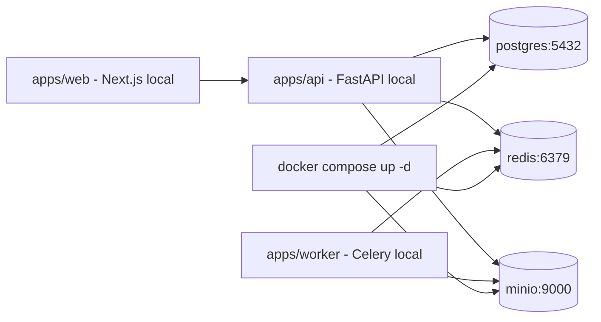
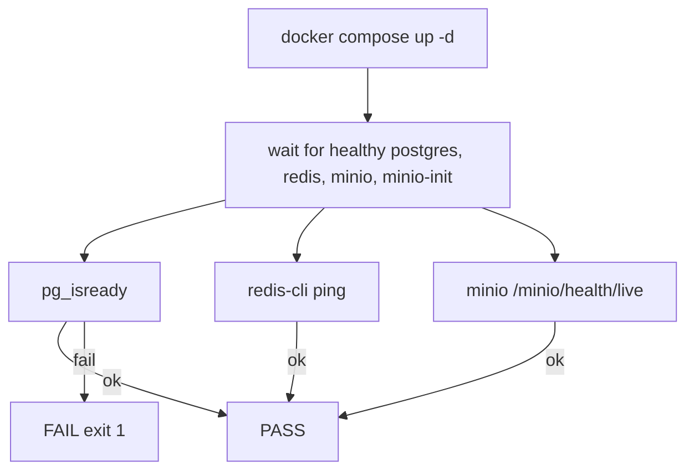

# Architecture — e1-local-infra

## Local Stack

```mermaid
flowchart LR
    WEB[apps/web - Next.js local] --> API[apps/api - FastAPI local]
    API --> DB[(postgres:5432)]
    API --> R[(redis:6379)]
    API --> M[(minio:9000)]
    WK[apps/worker - Celery local] --> R
    WK --> M
    COMPOSE[docker compose up -d] --> DB
    COMPOSE --> R
    COMPOSE --> M
```

## Smoke Flow

```mermaid
flowchart TD
    UP[docker compose up -d] --> WAIT[wait for healthy postgres, redis, minio, minio-init]
    WAIT --> PG[pg_isready]
    WAIT --> RD[redis-cli ping]
    WAIT --> MC[minio /minio/health/live]
    PG -->|ok| PASS[PASS]
    RD -->|ok| PASS
    MC -->|ok| PASS
    PG -->|fail| FAIL[FAIL exit 1]
```
